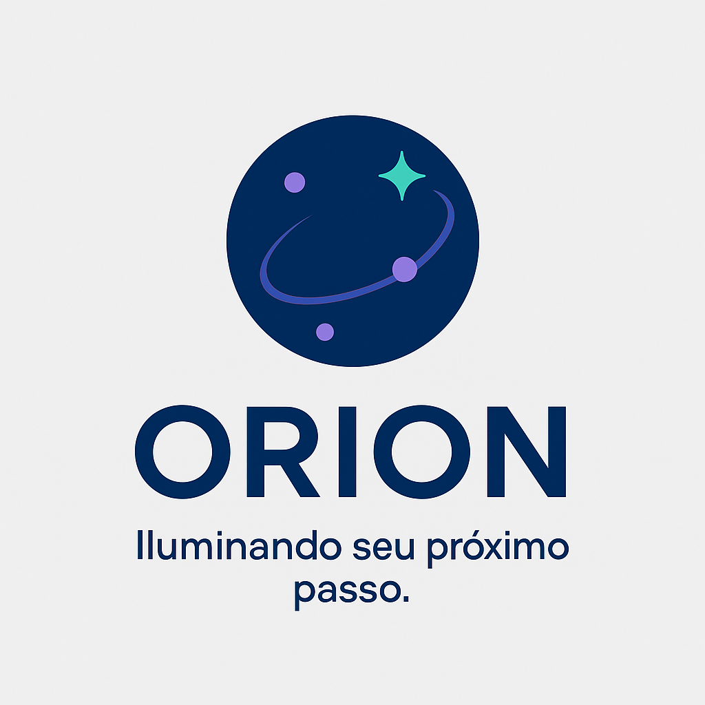
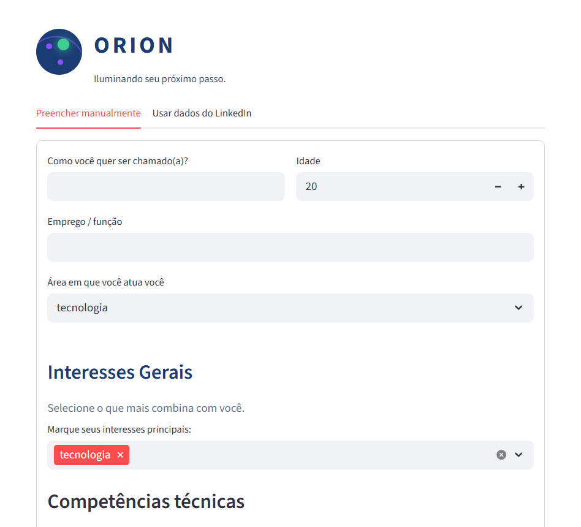
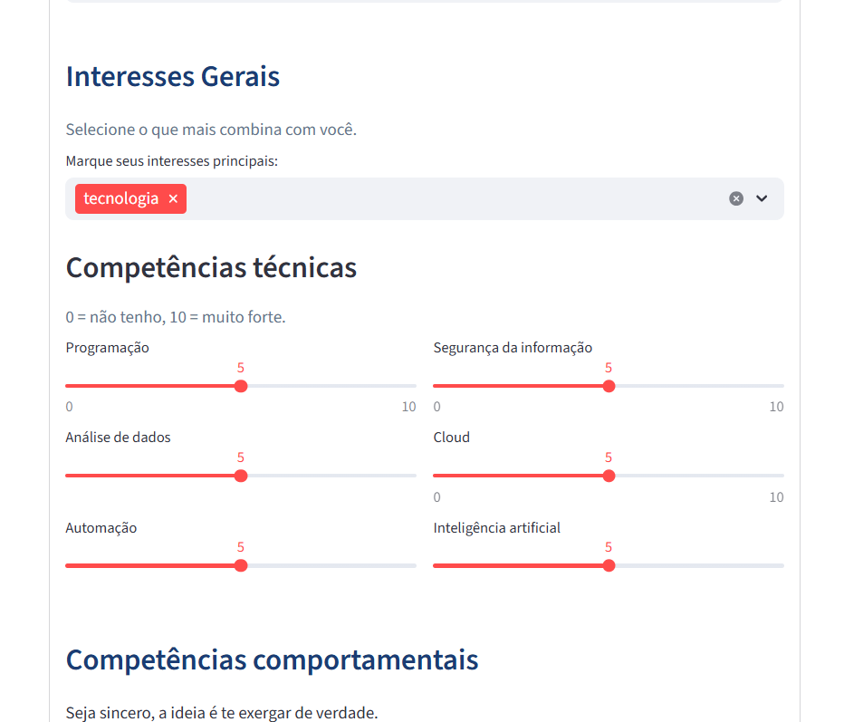
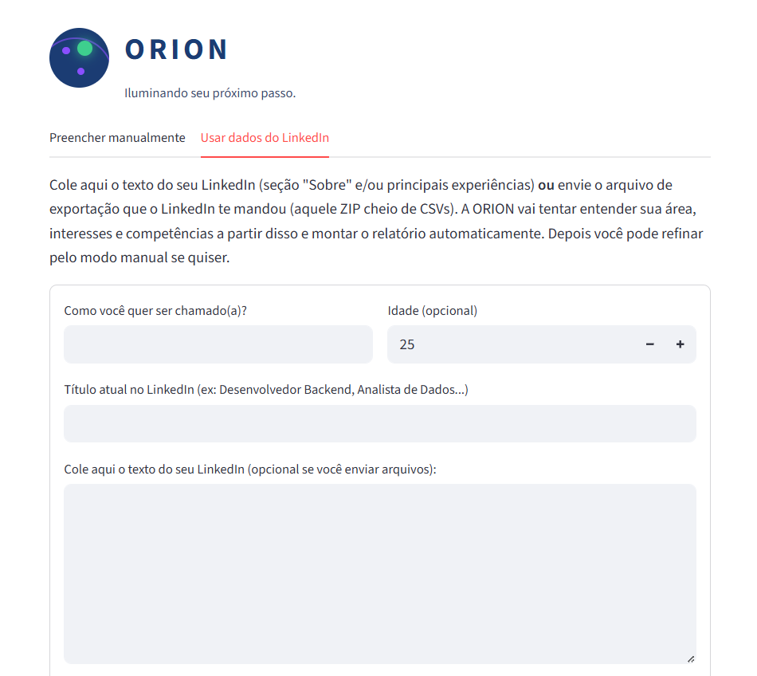

<div align="center">



# 🌌 ORION – Assistente Inteligente de Carreira  

Iluminando seu próximo passo profissional usando **dados, IA leve e muito foco em gente**.

[](https://www.python.org/)
[](https://streamlit.io/)
[](#)
[](#)

</div>

---

## 🎥 Demonstração do ORION

### 1. Tela principal – preenchimento manual  
Interface limpa e direta para o usuário informar nome, área, interesses e competências.



---

### 2. Seleção de interesses e competências técnicas  
Sliders intuitivos ajudam o usuário a avaliar seu próprio conhecimento.



---

### 3. Avaliação de competências comportamentais  
Uma etapa pensada para refletir sobre habilidades humanas essenciais.


---

### 4. Modo automático usando texto ou dados do LinkedIn  
O usuário pode colar informações do perfil ou enviar o ZIP oficial do LinkedIn.



---

### 5. Upload de arquivos e geração do relatório  
A aplicação interpreta os dados e entrega um relatório humanizado.


---

## 💡 O que é o ORION?

O **ORION** é uma aplicação construída em **Python + Streamlit** que ajuda pessoas a:

- entender o **risco de automação** da sua área/emprego;
- refletir sobre **novos caminhos de carreira**;  
- enxergar melhor suas **competências técnicas e comportamentais**;  
- receber **trilhas de aprendizado** sugeridas para se atualizar.

O foco é **tecnologia a serviço do humano**: nada de “substituir pessoas”, e sim apoiar decisões de estudo, transição e desenvolvimento.

---

## 🧠 Funcionalidades principais

### 1. Preenchimento manual

O usuário informa:

- Nome e idade  
- Profissão/emprego atual  
- Área de atuação / área de interesse  
- Interesses (ex.: dados, pessoas, negócios, criatividade, sustentabilidade…)  
- Competências técnicas (0 a 10)  
- Competências comportamentais (0 a 10)

O ORION então:

- estima o **risco de automação**;
- gera um **texto explicativo humanizado**;
- sugere **carreiras compatíveis**;
- monta uma **trilha de estudos**;
- permite baixar tudo em **`.txt`**.

---

### 2. Análise automática via LinkedIn

Além do modo manual, o app tem uma aba chamada **“Usar dados do LinkedIn”**, onde o usuário pode:

- colar o texto da seção **“Sobre”** / experiências, **ou**
- (versão estendida) fazer upload do **arquivo `.zip` de exportação de dados do LinkedIn**  
  – aquele pacote oficial cheio de arquivos `.csv`.

O ORION então:

- lê os textos relevantes (Profile Summary, Skills, Positions etc.);  
- detecta a **área de atuação**;  
- identifica **interesses e palavras-chave**;  
- sugere **competências técnicas e soft skills**;  
- gera o mesmo relatório completo, de forma automática.

---

## 🛠️ Tecnologias usadas

- **Python 3.12**
- **Streamlit** (interface web)
- **Pandas / CSV / ZIP** para leitura de dados estruturados
- **HTML + CSS embutido** para componentes visuais (barra de risco, layout etc.)

---

## 🚀 Como rodar o projeto localmente

```bash
# 1. Clonar o repositório
git clone https://github.com/nandoalmeidam/ORION.git
cd ORION

# 2. (Opcional) Criar ambiente virtual
python -m venv .venv
# Windows
.venv\Scripts\activate
# Linux / Mac
source .venv/bin/activate

# 3. Instalar dependências
pip install -r requirements.txt

# 4. Iniciar a aplicação
streamlit run app.py
```

O Streamlit vai abrir um link local (geralmente http://localhost:8501).
É só colar no navegador

🧩 Ideias de evolução

Usar modelos de linguagem mais avançados para análise de texto;

Conectar com APIs reais de vagas / mercado de trabalho;

Criar modo para empresas avaliarem times inteiros;

Exportar relatório em PDF com layout visual;

Criar ranking de carreiras baseado em aderência do perfil.

👨‍💻 Autores

Fernando Almeida (@nandoalmeidam) – desenvolvimento, lógica de negócio e interface

Gabriel Tarone (@Tarone14) – coautor no projeto acadêmico, conceitos e testes

⭐ Como apoiar

Se o ORION te ajudou ou te inspirou:

Deixe uma estrela (⭐) neste repositório

Compartilhe com alguém que esteja pensando em transição de carreira
